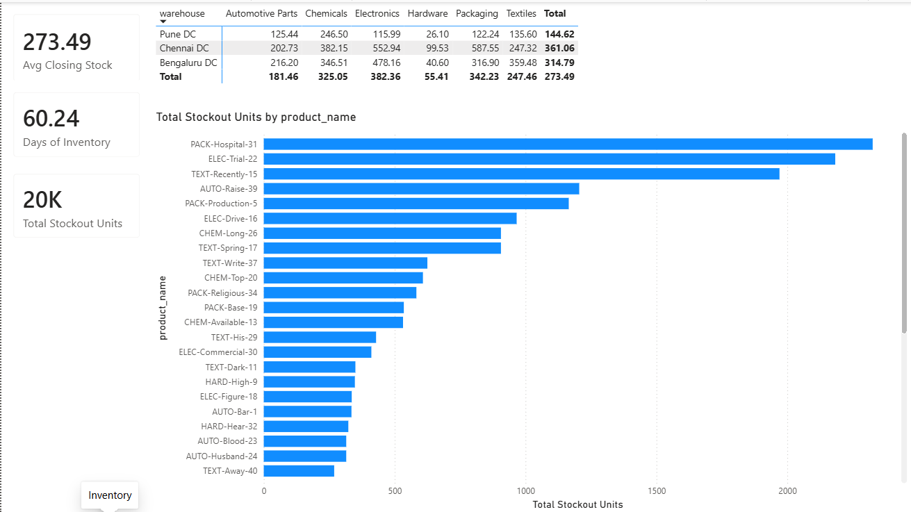
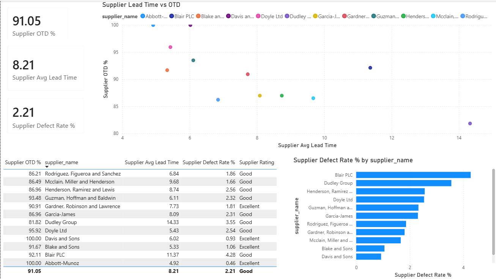

# Supply Chain Control Tower & Inventory Optimization

A supply chain analytics project built using SQL, Python and Power BI. The project covers demand analysis, demand forecasting, inventory optimization and supplier performance analysis using synthetic ERP-style data.

## Project Overview

The objective of this project was to build a small supply chain analytics system starting from raw operational data and ending with a Power BI dashboard.

The project includes:

- SQL-based supply chain analysis
- Demand forecasting using Moving Average and Simple Exponential Smoothing
- Forecast accuracy evaluation
- Inventory optimization using Safety Stock, Reorder Point and EOQ
- Comparison of a basic inventory policy with an optimized policy
- Power BI dashboards for monitoring inventory and supplier performance

## Objectives

The main questions explored in the project were:

- Which products generate the most revenue?
- Which products have frequent stockouts?
- How much inventory is being held?
- How efficiently is inventory being used?
- How are suppliers performing in terms of delivery and quality?
- How accurate are the demand forecasts?
- How can inventory policies be improved using demand and lead-time data?

## Tools Used

| Tool | Usage |
|---|---|
| SQL | Supply chain analysis and KPI calculations |
| Python | Demand forecasting and inventory optimization |
| Pandas | Data processing |
| Power BI | Dashboard and visualization |
| CSV | Data storage |

## Project Workflow

ERP-style Data
↓
SQL Analysis
↓
Demand Forecasting
↓
Forecast Accuracy
↓
Inventory Optimization
↓
Power BI Dashboard
↓
Business Insights

## 1. SQL Analysis

SQL was used to analyze the sales, inventory, purchase order and supplier data.

The analysis includes:

- Inventory turnover
- Days of inventory
- Stockout frequency
- ABC classification
- Fast and slow-moving products
- Supplier on-time delivery
- Supplier lead time
- Supplier defect rate
- Purchase price variance
- Monthly demand trends
- Supplier scorecard

SQL file:

`queries.sql`

## 2. Demand Forecasting

Weekly product demand was calculated from historical sales data.

Two forecasting methods were used:

- 4-week Moving Average
- Simple Exponential Smoothing

A 12-week rolling backtest was used to evaluate the forecasts.

The following metrics were calculated:

- MAE
- RMSE
- MAPE
- Forecast Bias

Files:

- `forecast.py`
- `forecast_accuracy.csv`

## 3. Inventory Optimization

The inventory optimization model calculates inventory policies using demand and supplier lead-time variability.

The model calculates:

- Safety Stock
- Reorder Point (ROP)
- Economic Order Quantity (EOQ)

The optimized policy was compared with a basic baseline policy.

Files:

- `optimize_inventory.py`
- `inventory_policy.csv`
- `policy_comparison.csv`

## 4. Power BI Dashboard

The Power BI dashboard has three pages:

### Executive Overview

The overview page contains:

- Total Revenue
- Inventory Value
- Stockout Rate
- Service Level
- Inventory Turnover
- Supplier OTD
- Monthly Revenue Trend
- Top 5 Products by Revenue
- Bottom 5 Products by Revenue

### Inventory

The inventory page contains:

- Average Closing Stock
- Days of Inventory
- Total Stockout Units
- Stockout Units by Product
- Warehouse and Category Inventory View

### Supplier

The supplier page contains:

- Supplier OTD
- Average Supplier Lead Time
- Supplier Defect Rate
- Supplier Performance Scorecard
- Lead Time vs OTD
- Defect Rate by Supplier

## Key Findings

- Total revenue across the dataset was approximately ₹463.03M.
- Inventory value at the latest week was approximately ₹62.96M.
- The overall stockout rate was 10.14%, corresponding to an 89.86% service level.
- Inventory turnover was 6.04, with approximately 60.24 days of inventory.
- Supplier on-time delivery performance was 91.05% overall.
- P015 and P039 recorded the highest stockout volumes among products supplied by S011, with 160 and 136 stockout units respectively. Both products had average supplier lead times above 11 days, while S011 had a lower baseline OTD of 80.6% and a 4.14% baseline defect rate, indicating supplier lead-time variability as a potential contributor to stockout risk.
- The inventory optimization simulation improved service level from approximately 99.82% to 99.93% while reducing total simulated inventory cost from approximately ₹55.83 lakh to ₹44.01 lakh.

## Dashboard Screenshots

### Executive Overview

### Inventory

### Supplier

## Key Dashboard Metrics

| Metric | Value |
|---|---:|
| Total Revenue | 463.03M |
| Inventory Value | 62.96M |
| Stockout Rate | 10.14% |
| Service Level | 89.86% |
| Inventory Turnover | 6.04 |
| Supplier OTD | 91.05% |
| Days of Inventory | 60.24 |

These figures are from the synthetic dataset used for the project.

## Dataset

The project uses synthetic ERP-style data for:

- Products
- Suppliers
- Customers
- Sales
- Purchase Orders
- Production
- Inventory

The data is intended for learning and portfolio demonstration.

## Repository Files

- README.md
- queries.sql
- forecast.py
- forecast_accuracy.csv
- optimize_inventory.py
- inventory_policy.csv
- policy_comparison.csv
- products.csv
- suppliers.csv
- customers.csv
- sales.csv
- purchase_orders.csv
- production.csv
- inventory.csv
- Supply Chain Project.pbix
- Executive Overview.png
- Inventory.png
- Supplier.png

## How to Use

1. Review the CSV datasets.
2. Run `queries.sql` using a compatible SQL environment.
3. Run `forecast.py` for demand forecasting and forecast accuracy.
4. Run `optimize_inventory.py` for inventory policy calculations.
5. Open `Supply Chain Project.pbix` to explore the Power BI dashboard.

## Author

Parth Mittal

B.Tech Mechanical Engineering  
Vellore Institute of Technology (VIT), Vellore
